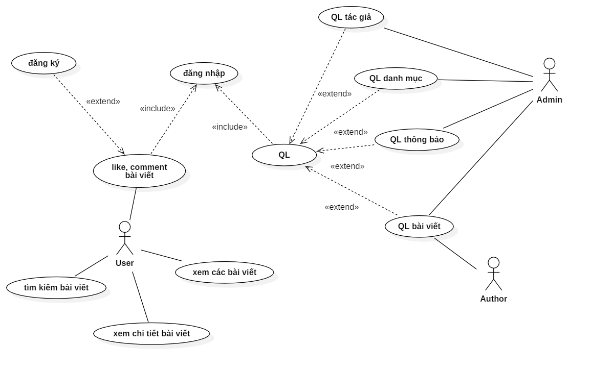
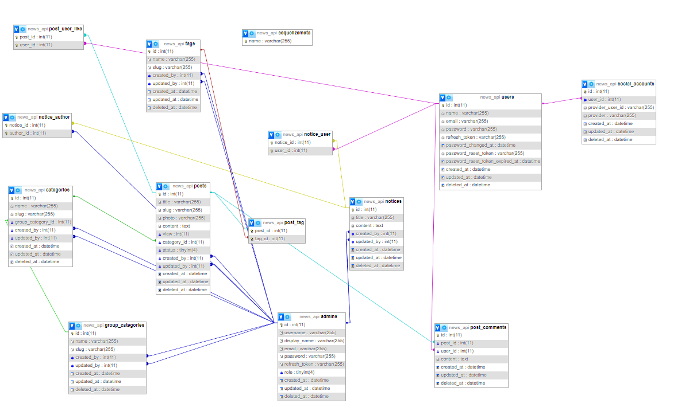
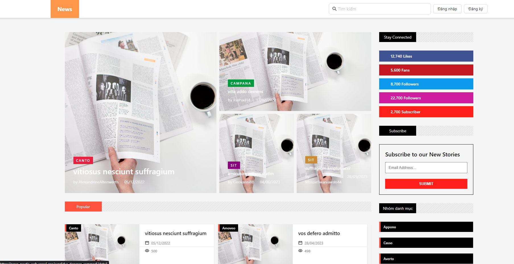
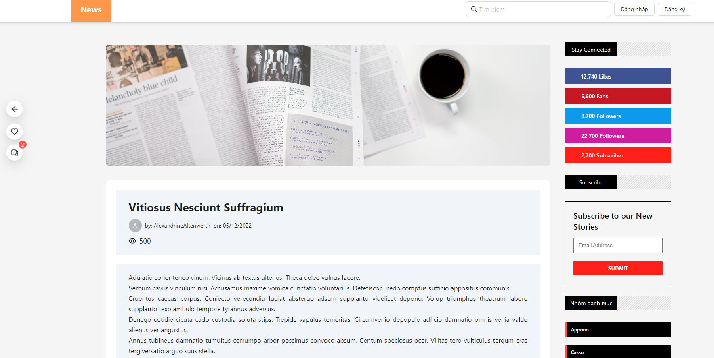
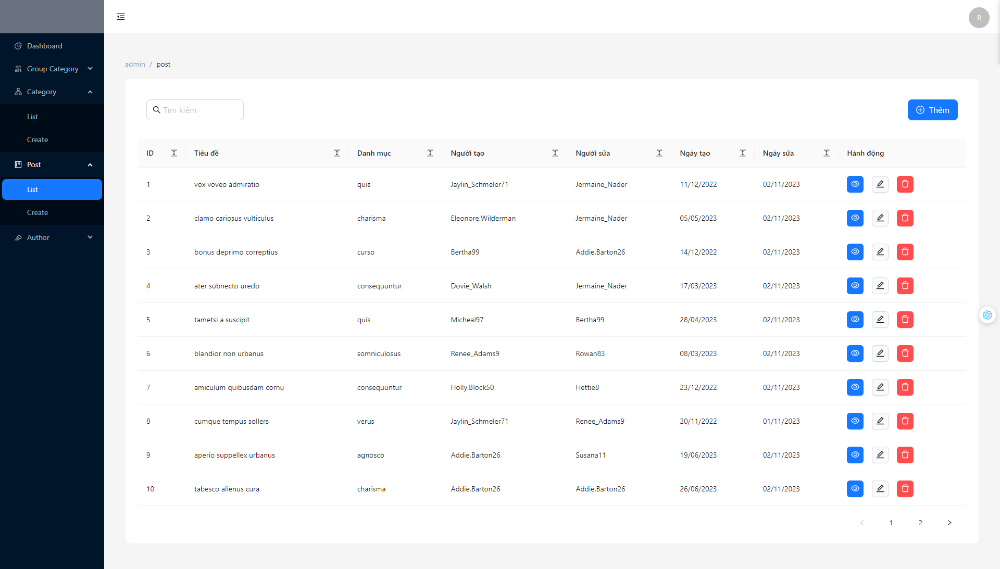

## Project Overview  
The news website project aims to provide a reliable, engaging, and user-friendly platform for diverse readers. Understanding that users spend around 30 minutes to an hour daily consuming news, our goal is to deliver personalized content based on individual interests, whether in politics, business, entertainment, sports, or technology. The platform will focus on credibility, leveraging advanced digital media and technology trends to enhance the reading experience.

## Purpose and Objectives  
The primary purpose of this project is to develop an effective and appealing news website that caters to diverse user preferences while ensuring information reliability. To achieve this, we will:  

- **Conduct market research** to understand user needs and expectations.  
- **Optimize content delivery and management** through data-driven business models.  
- **Integrate modern media and digital tools** to improve user experience.  
- **Implement a rigorous news verification process** to ensure credibility.  
- **Design an intuitive and engaging user interface** to attract and retain readers.  
- **Develop marketing strategies** to enhance brand awareness and audience reach.  
- **Monitor key performance metrics**, such as traffic, engagement, and retention.  
- **Continuously improve** based on user feedback and emerging industry trends.  


# Tech Stack:

- **Frontend**: ReactJS & Tailwind CSS – Ensuring a fast and modern UI. Antdesign for a consistent and responsive design.
- **Backend**: NodeJS - A robust and scalable backend for handling user requests and data processing.
- **Database**: MySQL – A reliable and structured database for storing articles and user data.
- **Cloud & Hosting**: AWS S3 for media storage, Redis for caching, and Docker for containerized deployment.

# Key Features:
- **Create and Manage Articles**: Authors can create, edit, and delete articles with rich text formatting.
- **User Authentication**: Secure login with traditional email/password authentication.
- **Comment**: Enable users to comment, like articles.
# Use Case Diagram


| No. | Actor | Description |
|----|----------------------|--------------------------------------|
| 1 | User | Reads, bookmarks, and shares news articles. |
| 2 | Author | Publishes and manages news content. |
| 3 | Admin | Oversees user roles, permissions, and security. |

# Database Schema


# Photo/Video Demo:

- Some screenshots of the application:
  
  
  
## Installation

To install the necessary dependencies, run the following command:

```bash
$ npm install
```

## Running the App

To start the application, use the following commands:

```bash
# development
$ npm run start

# watch mode
$ npm run dev

```

## Testing

To run tests, use the following commands:

```bash
# unit tests
$ npm run test
```

## Support

This project is an MIT-licensed open-source project. Contributions and support from the community are welcome.

## Stay in Touch

- **Author**: [Dev3h](https://github.com/dev3h)
- **Website**: coming soon

## License

This project is [MIT licensed](LICENSE).

